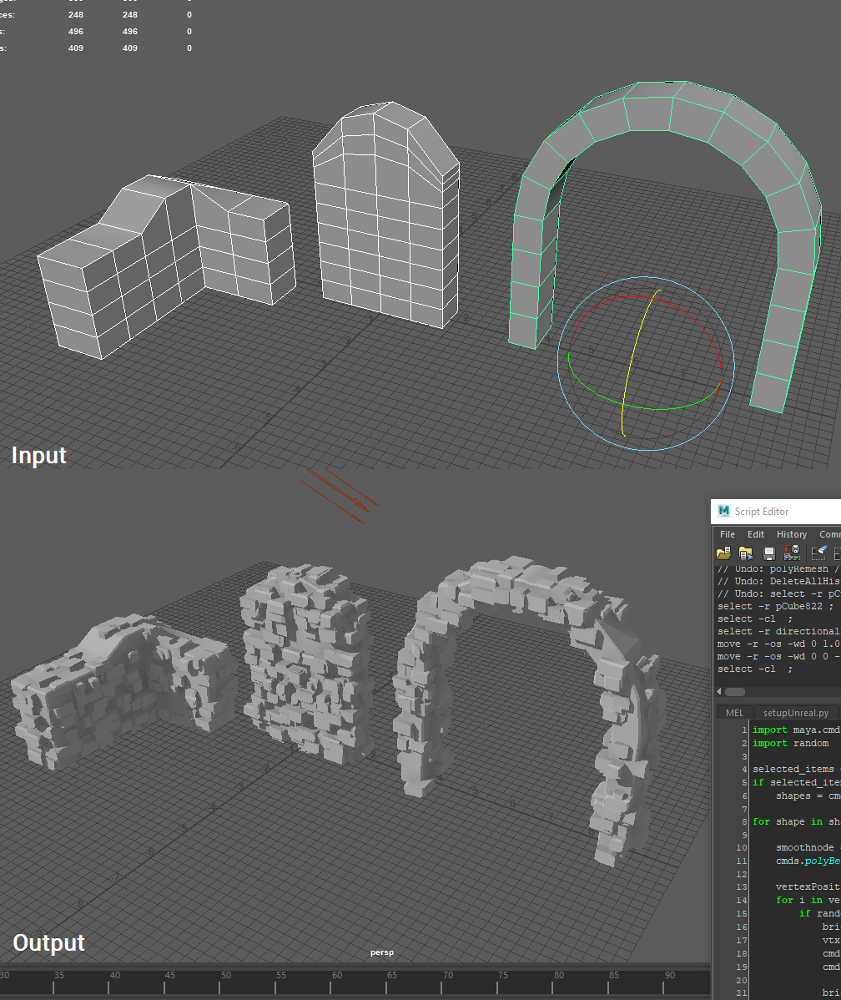

# Brickify
## Maya Python Script to generate bricks on guide geometry

I do a bunch of stone/brick wall modeling and after the 100th live surface brick placement I decided enough was enough. With this nifty little script, just create rough guide geometry then automatically spread a bunch of bricks onto the surface, ending up with something that could fit in *Breath of the Wild*.

Just stick *Brickify.py* inside *\Users\Your User Account\Documents\maya\Your Maya Version\scripts* to install it. Once you're inside Maya, just type *import Brickify* in the Python command bar on first use then *reload(Brickify)* from then on. Make sure you have your guide geometry selected!

